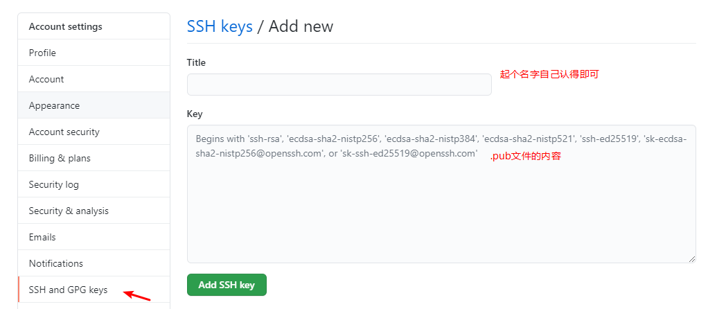

# Mac管理多个Github账户

## SSH模式

Mac管理多个Github账户 推荐使用这种方式

### 一、生成秘钥

``` shell
cd ~/.ssh
ssh-keygen -t rsa -f id_rsa
```

#### *说明

- -t 指定`加密方式` 默认：`rsa`， 常见值：`rsa`、`dsa`、`ecdsa`、`ed25519`
- -f 指定`秘钥名称` 不指定默认：`id_rsa`
- -C 设置`注释` 一般为`邮箱` 默认为`空`
- -N 设置`秘钥密码` 不指定会在执行中提示你设置，默认为`空`
- -b 指定`秘钥长度` 系统不同默认值不同 建议1024的倍数

### 二、配置config文件

```shell
vi ~/.ssh/config
```

将下面的配置根据自己生成的秘钥 配置到`config`

```shell
# 代理名称 随便起 不要设置成能正常访问的域名就行
Host githubhost
# 目标域名
HostName github.com
# 私钥位置 刚才生成的秘钥
IdentityFile ~/.ssh/id_rsa_githubm
# 代理 按需设置 用于加速访问
# ProxyCommand nc -v -x 127.0.0.1:7890 %h %p
```

#### *说明

- `Host` 代理名称 随便起 不要设置成能正常访问的域名就行
- `HostName` 目标域名 `github.com`
- `IdentityFile` 私钥位置 刚才生成的秘钥 刚才生成的叫什么名就填什么
- `ProxyCommand` 代理 按需设置 建议配
  - `nc` 代理方式  其他：`Ncat`
  - `-v` 展示链接详细信息 建议保留
  - `-x` 代理地址 `-x proxy_address:proxy_port`
  - `-X` 代理协议 proxy_protocol  --默认 `5`
    - `4`：Socks v4
    - `5`：socks v5
    - `connect`：HTTPS proxy
  - `%h` 替换远程主机地址
  - `%p` 替换远程主机端口

### 三、配置公钥到对应的github账号中

设置位置: `Settings -> SSH and GPG keys -> New SSH Key`  
将生成的`秘钥.pub`文件中的内容复制到里面 保存就好了



### 四、测试配置是否正确

```shell
ssh -T git@githubhost
```

#### *说明

- `githubhost` 为刚才在`config`文件中配置的 `Host`
- 成功则会展示success相关信息

### 五、clone项目

1. 复制`SSH`方式clone链接
2. 将`@`后面的`github.com`替换为刚才在`config`文件中配置的 `Host`的值，然后`git clone`即可

```shell
github.com --替换为---> githubhost
如：  git clone git@github.com:githubacc/my-repo.git
需
改为: git clone git@githubhost:githubacc/my-repo.git
```
